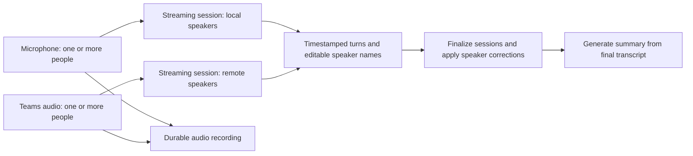

Current decision: the user approved AssemblyAI as the default (no opt-in).
The local implementation and rollout requirements are described in
[ASSEMBLYAI_IMPLEMENTATION.md](ASSEMBLYAI_IMPLEMENTATION.md). The research below
records the earlier candidate designs; its streaming-only and pause proposals
are superseded by that implementation.

# Streaming transcription proposal

Research date: 2026-09-14. Status: user approved a streaming evaluation of the
existing StackFuel recording plus synthetic audio, capped at USD 5. The evaluation
is separate from the app; provider integration is not approved yet. Requirements are in
[TRANSCRIPTION_QUALITY.md](TRANSCRIPTION_QUALITY.md).

Three evaluation rounds are complete: see [STREAMING_RESULTS.md](STREAMING_RESULTS.md).
German + English defaults were approved. Streaming still added words; a fresh
streaming-plus-batch test improved final text but failed consistent speaker
identity. The next decision is an opt-in two-pass prototype versus more speaker
validation. The original streaming-only proposal below is superseded as the
preferred text-quality candidate; it remains useful transport design context.

The two-pass candidate uses live streaming once, then one independent batch pass,
replaces the displayed transcript at completion and summarizes only that final
version. Expected rates are USD 0.80 per source-hour combined (0.57 streaming +
0.23 batch), excluding paused connected time and summaries. Two separate sources
would cost approximately USD 1.60 per meeting-hour if both run throughout. These
are estimates, not an approved production architecture. Persistent per-interval
submission accounting must reserve the second pass for finalization; uncertain
recovery cannot add a third transcription. Consistent speaker IDs and mapping
user-edited live names onto batch identities remain unresolved.

## Proposed first implementation

Use one continuous AssemblyAI stream per available audio source, with speaker
diarization within each stream. Start by evaluating `universal-3-5-pro` in
`max_accuracy` mode. Keep the existing durable audio recording independent of
transcription. Use finalized streaming text for the report after session closure;
do not routinely transcribe the full meeting a second time.

This preserves simultaneous local/remote speech better than mixing both sources
before recognition. It does not separate overlapping voices within the same
source, and microphone bleed may put the same voice into both streams. Those
are evaluation cases, not solved properties of this diagram.

## Verified capabilities and limits

AssemblyAI documents live turn/word speaker labels, unknown-speaker cases and
end-of-session speaker corrections that leave words and timing unchanged. The
feature is described as beta, with limitations for overlap and short utterances.
Its multichannel guidance uses a separate connection for each channel.
[Speaker documentation](https://www.assemblyai.com/docs/streaming/label-speakers-and-separate-channels)

The current model supports German, English and language switching. Its accuracy
preset is intended for applications that tolerate extra delay. This establishes
API fit, not accuracy on CheatMeet recordings.
[Models](https://www.assemblyai.com/docs/streaming/select-the-speech-model),
[accuracy preset](https://www.assemblyai.com/docs/streaming/getting-started/optimizing-accuracy-and-latency)

Streaming events replace earlier versions of a turn. Finalization must consume
the final events through `Termination`, rather than close immediately after
sending `Terminate`. Inspect the applied model in `Begin` because unknown query
parameters may be ignored.
[Protocol](https://www.assemblyai.com/docs/streaming/message-sequence)

Current Chrome recordings use WebM/Opus, which is not among the documented
streaming encodings. Proposed browser transport: AudioWorklet PCM capture,
resampled explicitly to 16 kHz and framed in 100 ms blocks, using the sample
count for timestamps. Do not send WebM chunks labeled as raw Opus or Ogg.
The WebSocket API lists PCM, raw Opus, Ogg Opus and ADTS AAC. It also exposes
continuous partials, which need explicit evaluation with diarization enabled.
[WebSocket reference](https://www.assemblyai.com/docs/streaming/api-spec/streaming-websocket)

## Scope in this repository

1. Add a structured transcript representation: source, session, turn ID, word
   times, optional speaker ID, provisional/final state and visible gaps. Preserve
   the existing plain transcript export and legacy report reader. Store speaker
   display names separately so a provider revision does not erase user edits.
2. Implement and test a pure event reducer before opening any provider connection:
   updated partials replace, final turns deduplicate, corrections change speaker
   attribution, unknown people remain unknown, malformed messages cannot invent
   text, and summary input excludes unfinished turns.
3. Add an authenticated server endpoint for temporary tokens; the provider key
   stays server-side. Bound token issuance and session counts per user, reject
   stale-owner results, and pin the stream to its recording owner. Token redemption
   expires separately from session duration; documented session maximum is three
   hours. [Token reference](https://www.assemblyai.com/docs/streaming/api-spec/generate-streaming-token)
4. Add the PCM transport beside the existing capture store. Run exactly one live
   backend for a recording. AudioWorklet output drives audio delivery; no
   timer-dependent segment boundaries. Bound queued audio and expose gaps on
   overload instead of accumulating unlimited memory.
5. Apply final speaker corrections before `pipeline.ts` calls analysis. Save
   structured transcript data through local storage and Drive with resumable,
   owner-checked writes. Assess Firestore document size before storing word-level
   data there; it is an index, not the full transcript archive.
6. Preserve the raw recording and explicit incomplete state on any transcription
   error. No automatic summary based on provisional or silently truncated text.
   Keep the existing backend available as an explicit configuration rollback.

Speaker IDs must include source and session identity. Label A in two independent
connections is not necessarily the same person. Cross-session identity after
reconnects and long meetings remains an unresolved acceptance item; never merge
people solely because provider letters match. Editable names/merging can help,
but do not substitute for testing consistent final attribution.

## Two-pass budget and recovery

Normal operation sends each source sample once, without overlapping segment
uploads. Provider-internal processing is opaque; the enforceable limit is at
most two application-level submissions of each source interval.

Persist submitted interval accounting before transmission. A dropped connection
leaves an uncertain tail; reserve the second submission for recovery or a final
pass, not both on the same interval. Do not blindly retry uncertain audio. Once
the budget is spent, keep a visible gap and the raw audio. Identical acoustic
speech captured on both mic and system is a separate echo issue to measure.

Sessions have a three-hour ceiling, and streaming faster than real time can be
rejected. Long meetings need session rollover; significant offline backlogs need
a different recovery path. Speaker continuity and bounded recovery must be
demonstrated before replacing the existing no-length-cap workflow.
[Session limits](https://www.assemblyai.com/docs/streaming/common-session-errors-and-closures)

For pauses, initially keep the session alive without submitting paused audio so
speaker context survives; this costs connected time. Track recording time
separately from connection time. Validate timestamp behavior on pause/resume.
[Session billing](https://support.assemblyai.com/articles/3853403741-how-does-pricing-work)

## Cost and endpoint proposal

Published base rates plus streaming diarization, excluding taxes, summaries,
optional features, recovery and paused connection time:

| Candidate | One connected source for 1 h | Two connected sources for 1 h |
| --- | ---: | ---: |
| Universal-3.5 Pro + diarization | USD 0.57 | USD 1.14 |
| Universal-Streaming Multilingual + diarization | USD 0.27 | USD 0.54 |

Calculated from base rates USD 0.45/0.15 per hour plus USD 0.12 diarization.
These are estimates from the current price list, not an account quote.
[Pricing](https://www.assemblyai.com/pricing/)

Propose the EU data-zone endpoint for an initial test. The default endpoint can
route to US or EU infrastructure; the EU endpoint pins streaming processing to
the EU. Verify account settings and applicable retention separately before
production enablement.
[Endpoints](https://www.assemblyai.com/docs/streaming/endpoints-and-data-zones)

## Capture coverage is a separate decision

Browser screen-audio support depends on browser, OS and chosen capture surface.
It cannot be made universal by changing ASR. A system-audio track is also not
proof that Teams speech is reaching it. Add source-level signal preview and a
real-device compatibility matrix; unsupported cases need an explicit supported
capture path, potentially a native helper. Do not silently claim mic-only fallback
satisfies a request to record remote participants.
[Capture API](https://developer.mozilla.org/en-US/docs/Web/API/MediaDevices/getDisplayMedia)

The current start path awaits Drive verification and microphone access before
requesting display capture. Native display capture requires transient user
activation. The synthetic UI test does not prove the native prompt survives
those waits: restructure preparation versus the final sharing click and test it
on real browsers before declaring capture complete.

## Next decision and checkpoints

- Decision made: run the small paid streaming evaluation before implementation.
- Offline prototype acceptance: correct event assembly, owner safety, two-pass
  accounting, late finalization and bounded connection-failure handling.
- Paid evaluation needs explicit recording scope and spending cap. Suggested
  first scope: the existing StackFuel recording and synthetic silence/speech;
  the StackFuel mix can evaluate ASR but cannot validate independent-source
  routing. Record raw events for reproducible offline fixtures.
- Stop again before expanding durable audio storage, adding a native helper,
  changing the production default or deploying.
- No architecture or model can promise zero invented words. Release evidence
  must include silence, quiet speech, real meeting intervals, overlap and gaps;
  unsupported or failed cases remain visible rather than being filled in.
